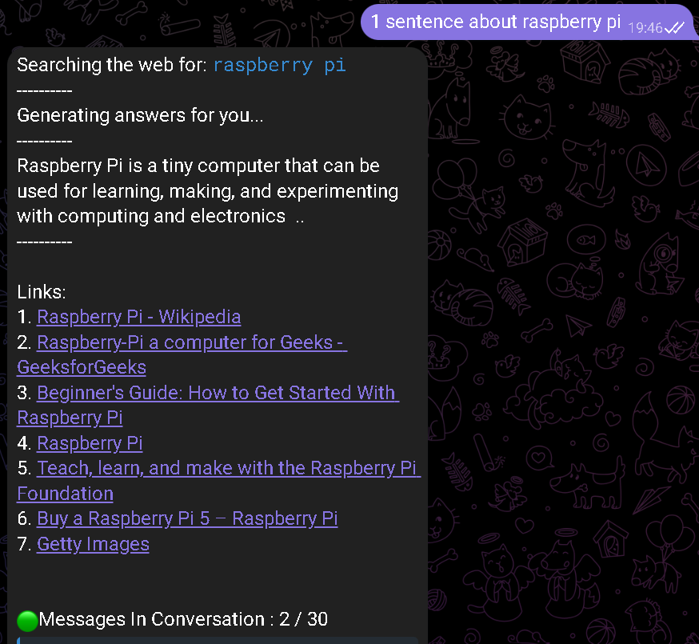

# BingChatBot

## Screenshot


## Command list

```
help - Show help message
reset - Reset conversation
switch - Switch conversation style ( creative , balanced , precise )
image - Generate a picture
```

# Setup

## Getting authentication

- Install the cookie editor extension for [Chrome and Edge](https://chrome.google.com/webstore/detail/cookie-editor/hlkenndednhfkekhgcdicdfddnkalmdm) or [Firefox](https://addons.mozilla.org/en-US/firefox/addon/cookie-editor/)
- Go to `bing.com`
- Open the extension
- Click "Export" on the bottom right (This saves your cookies to clipboard)
- Paste your cookies into a file `cookies.json`. The format of json refers to `cookie.exaple.json`(The middle field is omitted)

## Required variable

- Paste your environment variables into the `input` file
- The format of variables refers to `input.exaple`

## Install requirements

```shell
pip install -r requirements.txt
```

## Run

```shell
python main.py
```